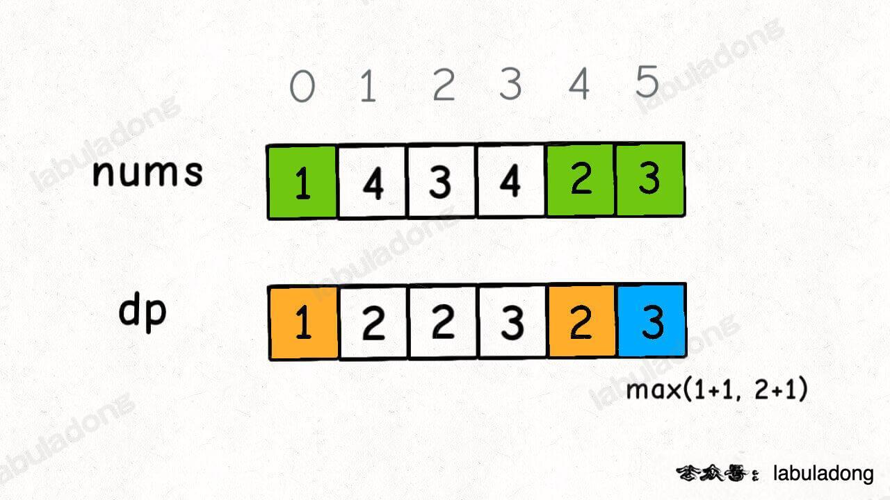

# 300. Longest Increasing Subsequence

Given an integer array `nums`, return _the length of the longest **strictly increasing**_&#x20;

_**subsequence**_.

&#x20;

**Example 1:**

<pre><code><strong>Input: nums = [10,9,2,5,3,7,101,18]
</strong><strong>Output: 4
</strong><strong>Explanation: The longest increasing subsequence is [2,3,7,101], therefore the length is 4.
</strong></code></pre>

**Example 2:**

<pre><code><strong>Input: nums = [0,1,0,3,2,3]
</strong><strong>Output: 4
</strong></code></pre>

**Example 3:**

<pre><code><strong>Input: nums = [7,7,7,7,7,7,7]
</strong><strong>Output: 1
</strong></code></pre>

根据刚才我们对 `dp` 数组的定义，现在想求 `dp[5]` 的值，也就是想求以 `nums[5]` 为结尾的最长递增子序列。

**`nums[5] = 3`，既然是递增子序列，我们只要找到前面那些结尾比 3 小的子序列，然后把 3 接到这些子序列末尾，就可以形成一个新的递增子序列，而且这个新的子序列长度加一**。

`nums[5]` 前面有哪些元素小于 `nums[5]`？这个好算，用 for 循环比较一波就能把这些元素找出来。



```
class Solution {
    public static int lengthOfLIS(int[] nums) {
        int[]dp = new int[nums.length];
        int max = Integer.MIN_VALUE;
        Arrays.fill(dp, 1);
        
        for(int i = 0; i < nums.length; i++){
            for(int j = 0; j < i; j++){
                // it means dp[j] and dp[i] can form a subsequence
                if(nums[i] > nums[j])
                    dp[i] = Math.max(dp[i], dp[j]+1);
                
            }
            max = Math.max(max, dp[i]);
        }
        return max;
    }
}
```
